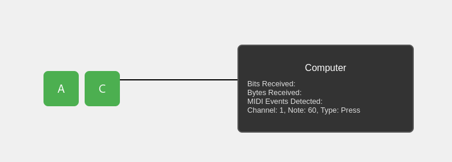

# Synth Synth

Welcome to SynthSynth, my failed and scrapped first attempt at a final project!

The idea behind this project was to create a slowed down representation of MIDI signal transmission.

Unfortunately, after lots of bugs, and a general loss of interest, I decided to scrap this project in favor of [interpolator](../interpolator/).

## Description

Before scrapping, I managed to implement a single 'middle C' key which transmits a signal through a wire, which is then interpereted by a 'computer' into a MIDI code.

Unfortunately, the successful decoding seems like a bit of a fluke - it falls apart for other keys, as exemplified by the 'A' key.

## Installation
Installation instructions:
```bash
npm i
npm run dev
```
Then, open `http://localhost:5173/` to view the application.

## How to Use
1. Press the 'C' key
2. Marvel as the signal is transmitted through the wire
3. Marvel agian as the "computer" decodes the press and release instructions for middle C.
4. Press the 'A' key
5. Marvel as everything breaks.

